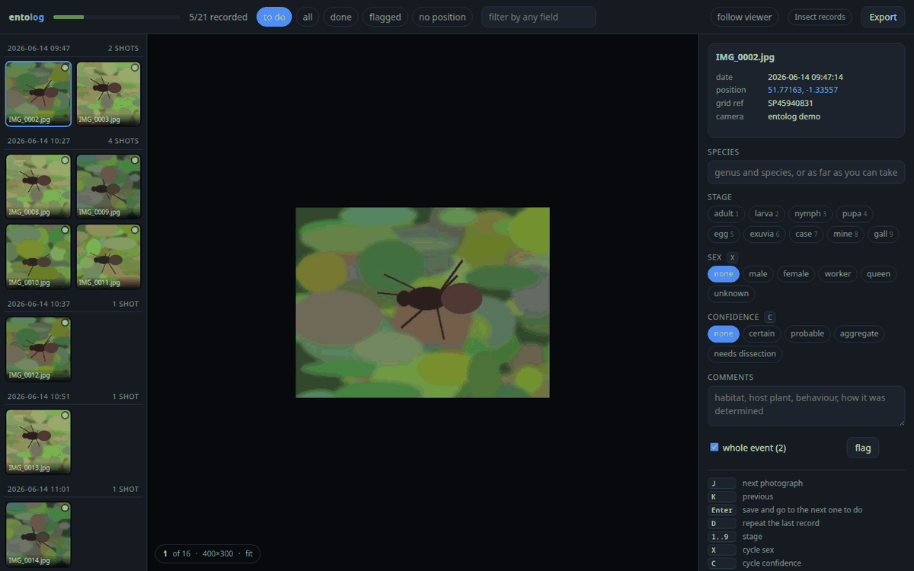
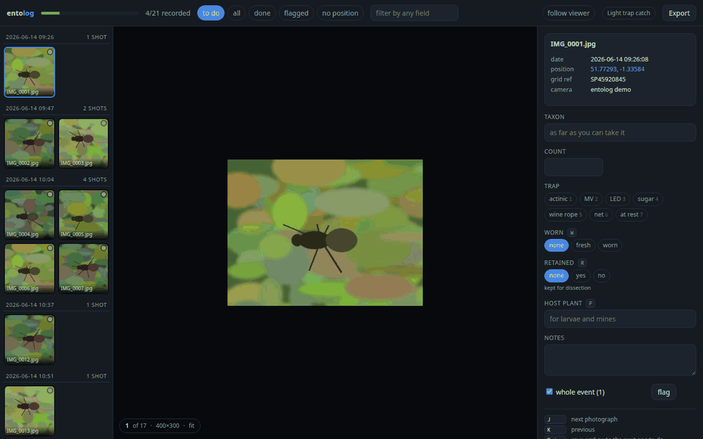
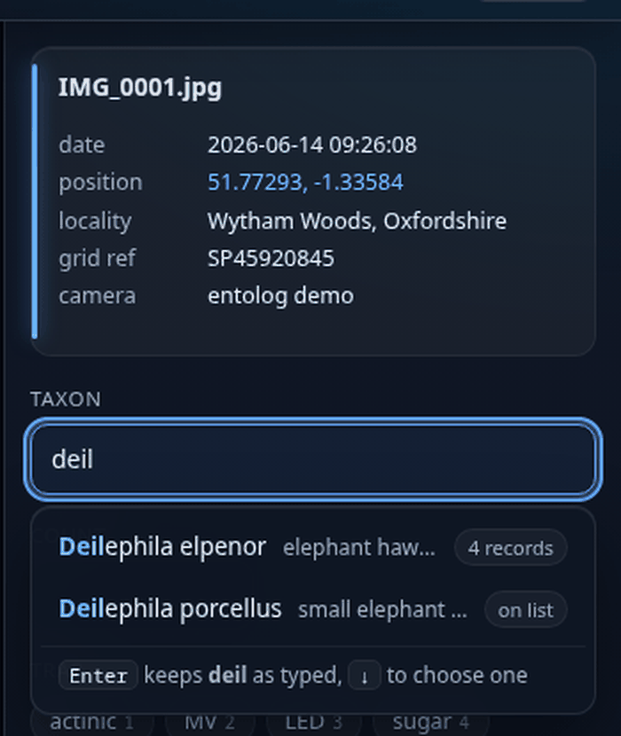
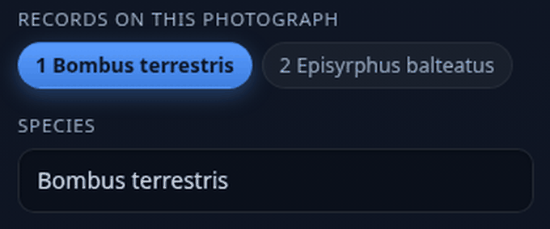

# entolog

**Turn a folder of photographs into a species record table.** With the fields you
decide on, from the window, the terminal, or the image viewer you already use.

[](https://github.com/A-e70/entolog/actions/workflows/tests.yml)



MIT licensed · no dependencies · 287 tests · one file to download · nothing leaves your machine

## The problem

A day in the field produces a card full of photographs. Somewhere between that
card and a recording scheme, somebody has to turn pictures into rows: name, date,
place, stage, sex, notes. That typing is most of the work, and it is why cards sit
undone for a season.

Nearly every tool in this space starts *after* that step, from a spreadsheet you
have already filled in, or a web form you type into one record at a time.

entolog is the step itself. The photograph already knows **when** and **where**.
You know **what**. So it reads the date and the position out of the EXIF, works
out a grid reference, groups a burst of shots into one specimen, and takes the
rest as fast as you can type it.

```
filename	date	time	latitude	longitude	locality	species	stage	sex	comments
IMG_0421.jpg	2026-06-14	09:26:07	51.753792	-1.257281	Wytham Woods, Oxfordshire	Vespa crabro	adult	female	on ivy, sunny bank
```

## Thirty seconds

```bash
python3 -m entolog demo
```

Writes 21 demo photographs with real EXIF, reads them, and opens the window. No
camera card, nothing to install, nothing uploaded. The pictures are drawings and
say so; everything else behaves exactly as it will on your own card.

Then, on your own photographs:

```bash
python3 -m entolog ~/photos/june-fieldwork
```

## The fields are yours

A **profile** is a JSON file listing what a record contains. The storage, the form
in the window, the terminal grammar, the keyboard shortcuts, the autocomplete, the
validation, the export columns and the Darwin Core terms are all generated from
it. There is no field list anywhere in the code.

This is the same window as above, on the same photographs, under a moth-trapping
profile:



```json
{
  "name": "moths",
  "primary": "taxon",
  "fields": [
    {"name": "taxon", "type": "text", "learn": true, "dwc": "scientificName"},
    {"name": "count", "type": "number", "min": 1, "dwc": "individualCount"},
    {"name": "trap", "type": "choice", "digits": true, "open": false,
     "choices": ["actinic", "MV", "LED", "sugar", "net"]},
    {"name": "retained", "type": "bool", "key": "r"},
    {"name": "host_plant", "type": "text", "learn": true, "key": "p",
     "dwc": "associatedTaxa"}
  ]
}
```

Built in: `insects`, `moths`, `wildlife`, `birds`, `plants`. Start from the
closest one and edit it. Full reference in [docs/profiles.md](docs/profiles.md).

```bash
python3 -m entolog profile show > mine.json
python3 -m entolog profile use mine.json
```

## Four ways to record, one set of records

Same profile, same validation, same storage, same exports. Use whichever suits
the hour, and keep using your own image viewer alongside any of them.

### The window

Left is the folder, grouped into specimen events: consecutive shots within 150
seconds and 60 metres are almost always the same individual, so they are grouped
and you record them once. Middle is the photograph. Scroll to zoom and drag to pan, which matters when the
difference is a tarsal segment. The point under the pointer stays under the
pointer, a trackpad and a mouse wheel move at the same rate, and the photograph
cannot be dragged off the edge of its own frame. It magnifies to eight times the photograph's own
pixels, and past twice them it stops smoothing and shows the pixels as they are,
which is both crisper and more honest than invented detail. Double click goes to
1:1 and back, `0` fits it again, and the readout is a percentage, so `453%` says
plainly what you are looking at. Right
is the record, saved as you type. There is no save button.

| key | does |
|---|---|
| `J` `K` | next photograph, previous |
| `Enter` | save and jump to the next one still to do |
| `D` | repeat the last record, for a run of the same species |
| `1`…`9` | whichever field has `digits` |
| your letters | whatever `key` you gave each field |
| `G` | whole event on or off |
| `F` | flag for a second look |

Any field that learns suggests as you type, from the species already in your
records and from whatever checklist you loaded. What you have recorded before
comes first, a common name finds the scientific one, and an abbreviation finds
the only thing it can mean.



Nothing you type is ever replaced unless you choose a suggestion. The line under
the list says so while you type, and pressing Enter without choosing keeps
exactly what you wrote. Load your own taxon list and the suggestions come from
that too, marking a synonym as what it is.

### The terminal

```
$ python3 -m entolog enter

12/240 IMG_0421.jpg  2026-06-14 09:26  Wytham Woods SP4594 0830  |   [event 4, 3 shots]
> Vespa crabro / adult / f / on ivy
saved 3 photographs: Vespa crabro adult female on ivy

15/240 IMG_0424.jpg  2026-06-14 09:31  Wytham Woods SP4594 0830  |   [event 5, 2 shots]
> vecr
vecr -> Vespa crabro
saved 2 photographs: Vespa crabro
```

Three ways to say the same thing, all from your profile:

```
Vespa crabro / adult / f / on ivy      fields in order, / between them
species='Vespa crabro' sex=f           name=value, any order, any subset
vecr                                   an abbreviation, if it can only mean one thing
```

An abbreviation resolves only when it can mean exactly one thing; when it cannot
you get the candidates and nothing is written. A name typed out in full is never
rewritten. Tab completes. Commands are `:` prefixed or punctuation, so nothing
you can type as a species name is ever mistaken for one: `.` repeats, `#` flags,
`*` switches between event and photograph, `:f todo`, `:n 12`, `:h`, `:q`.

### The image viewer you already use

Three commands, and your viewer keeps doing the looking.

```bash
export ENTOLOG_DB=~/photos/june/entolog.db
entolog current  IMG_0421.jpg                     # this is what I am looking at
entolog line     IMG_0421.jpg                     # one line for a status bar
entolog record   - "Vespa crabro / adult / f"     # record the current one
```

```bash
feh --action1 "entolog record %f 'Vespa crabro / adult'" \
    --action2 "entolog current %f" \
    --info "entolog line %f" ~/photos/june/*.jpg
```

Once something is calling `entolog current`, the terminal follows it with
`entolog enter --follow` and the window follows it with the **follow viewer**
button. feh, nsxiv, geeqie and anything else that can run a command:
[docs/viewers.md](docs/viewers.md).

### The table in vim

```bash
python3 -m entolog edit          # $EDITOR on the whole table, read back on exit
```

```
id   species        stage   sex      comments             filename      date        gridref
41   Vespa crabro   adult   female   on ivy, sunny bank   IMG_0421.jpg  2026-06-14  SP45940830
42   Vespa crabro   adult   female   on ivy, sunny bank   IMG_0422.jpg  2026-06-14  SP45940830
43                                                        IMG_0423.jpg  2026-06-14  SP45940831
```

Columns are matched by name, so delete columns, reorder them, sort the rows, or
cut it down to `id` and one field. Deleting a row does not delete the record. A
value that fails a check is reported by line number and still kept.
`entolog table` and `entolog apply` do the two halves separately.

## More than one thing in a photograph

A light trap egg box holds ten moths. A leaf holds two mines. A flower holds a
bumblebee and a hoverfly. So a photograph can hold more than one record.



In the window, **+ record** adds one and a row of tabs appears at the top of the
form. In the terminal it is `:o +`, and `:o` lists what a photograph holds. Each
record exports as its own occurrence, with its own identifier, and the first
record keeps the identifier it always had.

Nothing is written until you type something, so changing your mind leaves nothing
behind, and a photograph with one record looks and behaves exactly as before.

## Names, dates and positions

Three things decide whether a record is usable, and entolog can check all three
against something better than memory. In full in
[docs/records.md](docs/records.md).

**Names.** entolog ships no taxonomy. Load the list you are entitled to use, and
names carry its identifier into every export:

```bash
entolog taxa import uksi.csv
```

`taxonID`, `scientificNameAuthorship`, `taxonRank` and `acceptedNameUsage` follow
each record into the Darwin Core Archive, and the iRecord export gains a Taxon
Version Key column. A name the list calls a synonym is offered as one, recorded
as you typed it, and reported by `entolog check`.

**Dates.** A camera clock that was never set is the commonest fault in a set of
photographic records. Where the camera saved a GPS fix it also saved the
satellite time, which is right by definition:

```
$ entolog time
20 photographs carry a satellite fix as well as a camera time.
  the camera reads +1h47m against UTC
  in a +1h zone the clock is 47m fast
  in a +2h zone the clock is 13m slow

Correct it with the zone you were in:
  entolog time --from-gps --zone +1h
```

Which part of that is the time zone is not in the file, so entolog offers both
readings rather than picking one and being quietly wrong. Corrected dates are
marked as corrected, and the opposite shift puts them back.

**Positions.** Britain gets the Ordnance Survey grid, Ireland gets the Irish
grid, chosen by where the photograph was taken. The EXIF position of a photograph
taken in your garden is your home address, and a record of a sensitive species is
a map to it, so any record can be published as the square it falls in instead:

```bash
entolog record IMG_0421.jpg --precision 1km    # this record
entolog set blur 1km                           # everything, by default
```

The exported position is then the centre of the square the reference names, with
`coordinateUncertaintyInMeters` and `informationWithheld` to match. The exact
position never leaves your database.

## Taking it back, and keeping it

```bash
entolog undo          # Ctrl+Z in the window, :u in the terminal
entolog backup        # the database is the record. Copy it somewhere
```

One keystroke that records a whole specimen event is one step back. So is a whole
table read in from `$EDITOR`.

## Check before you send

```bash
$ python3 -m entolog check
! 3 records have no position
    Add a grid reference by hand, or use the 'no position' filter
    IMG_0455.jpg, IMG_0456.jpg, IMG_0461.jpg
! 8 records are dated before 1995, which no digital camera was
    The camera clock was reset, usually by a flat battery
? species written 2 ways: 'Vespa crabro', 'Vespa  crabro'
    Only spacing or capitals differ, so these are one name
? 2 records have a species that is not in your checklist: 'Vespa velutina'
- 4 photographs still flagged
```

The pass a scheme's verifier would do, run on your own machine while the
photographs are still in front of you.

## Exports

```bash
python3 -m entolog export -f dwca    -o records.zip      # Darwin Core Archive
python3 -m entolog export -f irecord -o for-irecord.csv  # iRecord's own columns
python3 -m entolog export -f tsv     -o records.tsv      # a plain table
```

`dwca` is a real Darwin Core Archive: `occurrence.csv`, a `meta.xml` describing
every column as a Darwin Core term, and an `eml.xml` carrying the recorder and
the licence. It is what GBIF, an IPT and the NBN Atlas ingest. Every record has a
stable `urn:entolog:` occurrenceID that will not collide with anyone else's.

Also `csv`, `full`, `dwc` flat, `geojson`, `json`, `md`. Any field with a `dwc`
term travels into the archive automatically, so your own fields go with the
records. See [docs/exports.md](docs/exports.md).

```bash
python3 -m entolog set recorded_by "A Naturalist"
python3 -m entolog set licence CC-BY      # CC0, CC-BY or CC-BY-NC only
```

## What it does about the awkward cases

**No GPS in the file.** The position stays empty rather than guessed, and the
`no position` filter lists exactly which photographs need a grid reference by
hand.

**No EXIF date.** Falls back to the file's timestamp, records that it did so in
`date_source`, and shows it in amber, so a record resting on a weaker date is
never silently mixed in with the rest.

**Raw files.** NEF, CR2, CR3, ARW, RAF, ORF, RW2, DNG and friends are read
directly, since they are TIFF underneath.

**Renamed or moved photographs.** Fingerprinted, so a photograph that moves
folder carries its whole record with it on the next scan.

**Re-scanning.** Always safe. New files added, everything already recorded left
alone.

**Southern and western hemispheres.** EXIF stores degrees and a separate N/S/E/W
reference. Both are read, so Australia and Chile come out negative rather than
mirrored, which is the classic way a record lands in the wrong ocean.

**A value that fails its own rule** is still stored. Losing what someone typed is
worse than storing something odd, so the complaint is shown and the text kept.

**Grid references** are calculated offline and are exact against the Ordnance
Survey test point, TG 51409 13177. Outside Britain the column is empty rather
than wrong.

## What it does not do

It does not identify anything: there is no image recognition. It ships no
taxonomy of its own, though it will use the one you bring. It does not store or publish records anywhere, and has
no account and no server. It is not a photo manager and never writes to your
images. See [docs/comparison.md](docs/comparison.md) for how it sits alongside
iRecord, iNaturalist, MapMate and a spreadsheet.

## Install

Python 3.9 or newer. Nothing else.

**One file, nothing installed.** The quickest way to try it:

```bash
curl -LO https://github.com/A-e70/entolog/releases/latest/download/entolog.pyz
python3 entolog.pyz demo
```

Move it onto your path and it becomes a command:

```bash
chmod +x entolog.pyz && mv entolog.pyz ~/.local/bin/entolog
entolog demo
```

**As a package**, which also gives you the `entolog` command:

```bash
pipx install git+https://github.com/A-e70/entolog
# or
python3 -m pip install --user git+https://github.com/A-e70/entolog
```

**From source:**

```bash
git clone https://github.com/A-e70/entolog && cd entolog
python3 -m entolog demo
```

On Windows use `py` where these pages say `python3`.

> Throughout the documentation, **`entolog`** means whichever of the three you
> have: the command, `python3 entolog.pyz`, or `python3 -m entolog`. They are the
> same program.

Pillow is optional, only to preview raw files a browser cannot show. `exiftool`
is optional, as a second opinion on HEIC and unusual raws. `entolog doctor` says
what this machine has.

## Documentation

- [Quick start](docs/quickstart.md), five minutes from nothing to a file a scheme takes
- [Profiles](docs/profiles.md), deciding what a record contains
- [Exports](docs/exports.md), which format which scheme wants
- [Image viewers](docs/viewers.md), feh, nsxiv, geeqie and anything else
- [Getting a record right](docs/records.md), names, dates, positions, undo, backup
- [Where entolog fits](docs/comparison.md), honestly, next to what already exists
- [For organisations](docs/organisations.md), deployment, scheme profiles, data licensing and what stays local
- [Changelog](CHANGELOG.md) · [Contributing](CONTRIBUTING.md)

## Files

```
entolog/profile.py    what a record contains, and validating that
entolog/profiles/     the built-in profiles
entolog/records.py    reading and writing the recorder's own fields
entolog/entry.py      the terminal loop, the status line, the viewer hooks
entolog/tsvedit.py    the table as a file you can edit and read back
entolog/check.py      the record cleaning pass
entolog/taxonomy.py   the taxon list you supply, and the identifiers it carries
entolog/clock.py      measuring and correcting the camera clock
entolog/exifread.py   EXIF out of JPEG, TIFF raws, PNG, WebP. No dependencies
entolog/locality.py   short locality from a verbose lookup, OSGB grid references
entolog/scan.py       folder to database, fingerprints, specimen events
entolog/export.py     tsv, csv, Darwin Core Archive, iRecord, GeoJSON, JSON
entolog/server.py     the local server, standard library only
entolog/web/app.html  the whole window, one file, built from the profile
```

Everything lives in one SQLite file next to the photographs, `entolog.db`. It is
the record, so back it up with them.

```bash
python3 -m unittest discover -s tests      # 287 tests, no network, no camera
./build.sh                                 # dist/entolog.pyz, one file
```

## Licence

MIT. See [LICENSE](LICENSE). Contributions are accepted on the terms in
[CONTRIBUTING.md](CONTRIBUTING.md).
